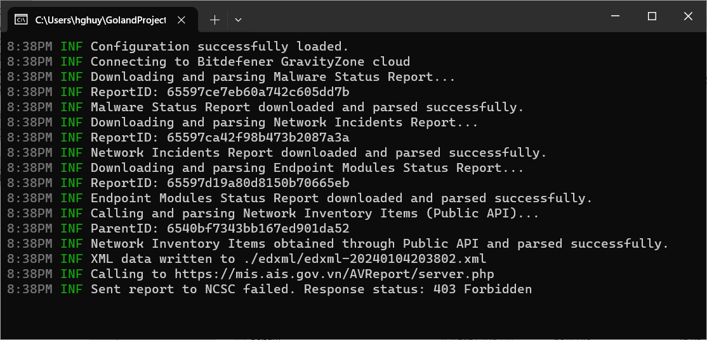

# Bitdefender GravityZone to NCSC Connector
This tool connects and shares Bitdefender GravityZone Control Center reports in edXML format with the Vietnam National Cyber Security Center.

Decree guide: 2290/BTTTT-CATTT.

## Installation and Setup
### 1. Set Environment
#### Windows:
    $env:TG_BOT_TOKEN = "your_telegram_bot_token"
### 2. Build
#### Windows:
    go build -ldflags "-X main.botToken=%TG_BOT_TOKEN%" -o Bit2GovSOC-v1.7.exe .\main.go`
## Usage
The tool will connect to Bitdefender GravityZone Control Center, retrieve reports in edXML format, and share them with the VNCSC.

Setup your configuration using a local `conf.env` file in the same directory of your tool.

    MODE=cloud
    ORGANID=000.00.00.XXX
    ORGANNAME=Sở Thông tin và Truyền thông tỉnh XXX
    ORGANADD=Số XX, đường XXX, phường XXX, thành phố XXX, tỉnh XXX
    ORGANEMAIL=attt@xxx.gov.vn
    ORGANPONE=02513810269
    ORGANWEBSITE=https://stttt.xxx.gov.vn
    
    BIT_ENPOINT=https://your_bitdefender_endpoint
    BIT_APIKEY=your_bitdefender_api_key
    
    GOVSOC_ENPOINT=https://mis.ais.gov.vn/AVReport/server.php
    TG_GROUP_ID=your_telegram_group_id

Directories created:
- /log: Log files for debugging and monitoring. 
- /temp: Temporary storage for intermediary files.
- /edxml: Stores Bitdefender reports in edXML format before sharing with VNCSC.
## Additional Information
For more details about the Decree guide (2290/BTTTT-CATTT), refer to the official documentation provided by the Vietnam National Cyber Security Center.

https://thuvienphapluat.vn/cong-van/Cong-nghe-thong-tin/Cong-van-2290-BTTTT-CATTT-2018-huong-dan-ket-noi-chia-se-thong-tin-ve-ma-doc-giua-cac-he-thong-387771.aspx
## Contributing
Contributions are welcome! If you find any issues or have suggestions for improvements, please open an issue or create a pull request.

## License
This project is licensed under the MIT License.